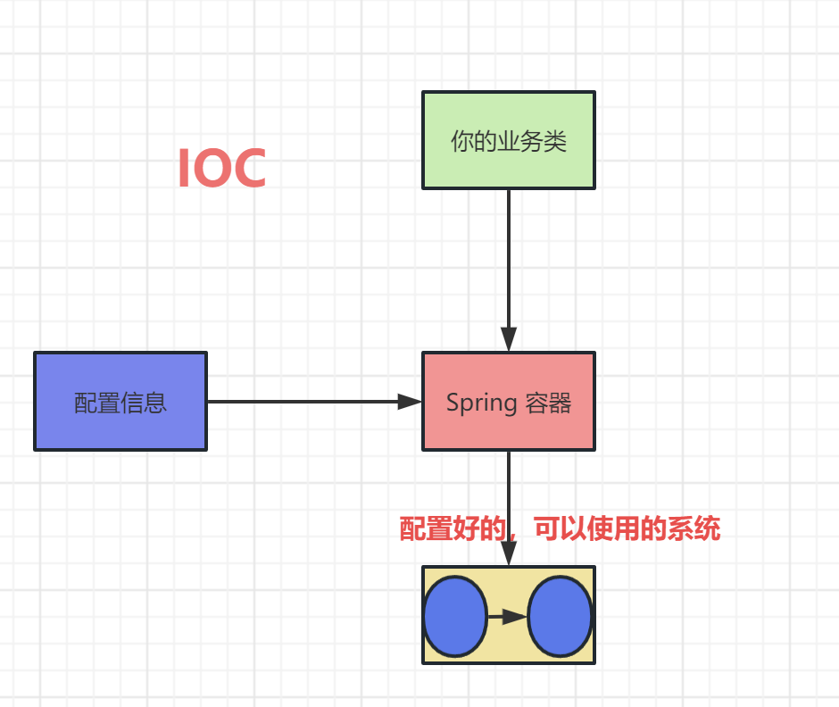
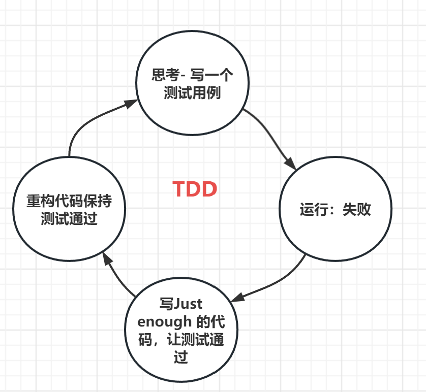
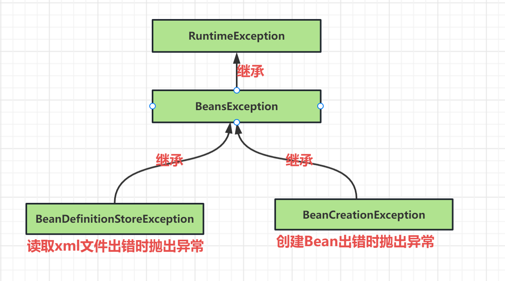
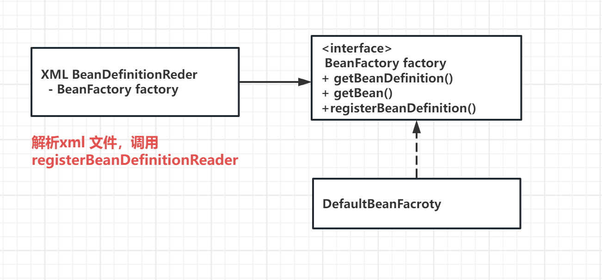
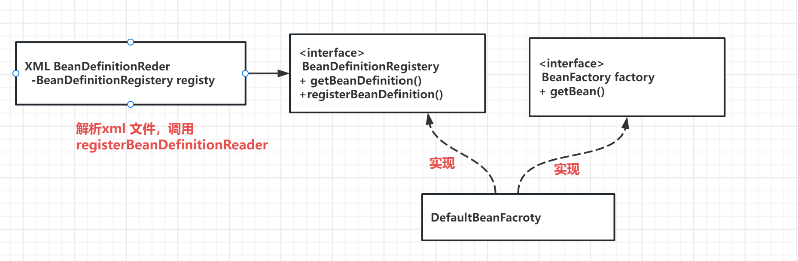
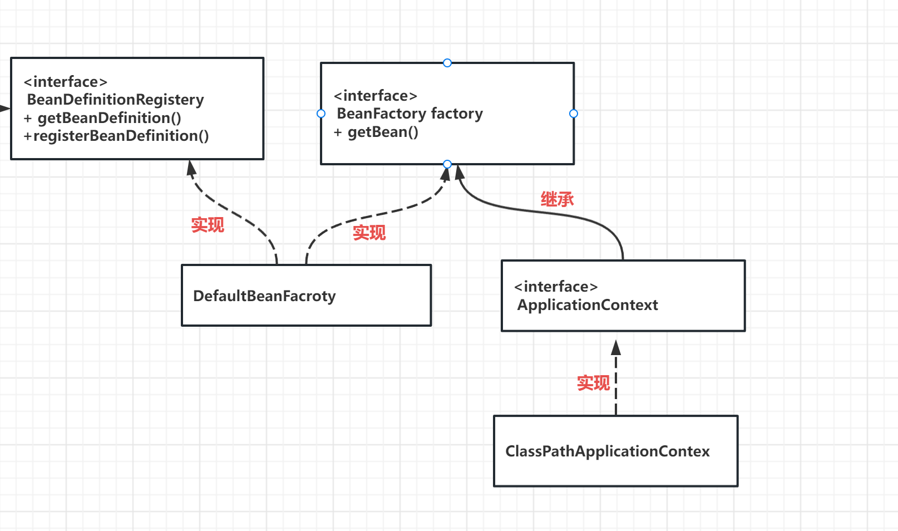
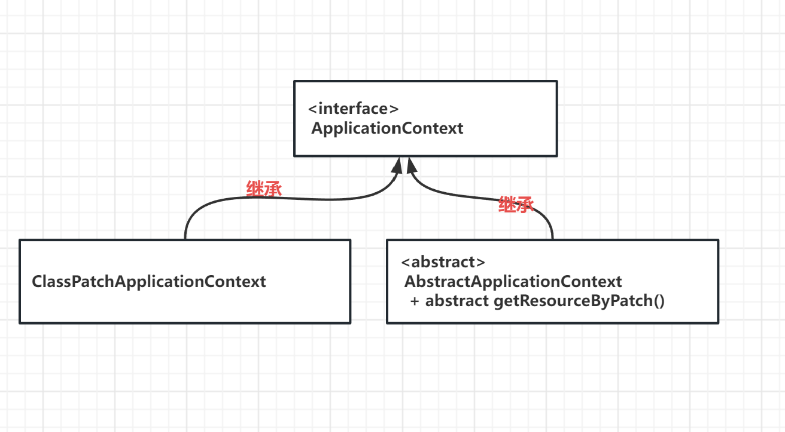
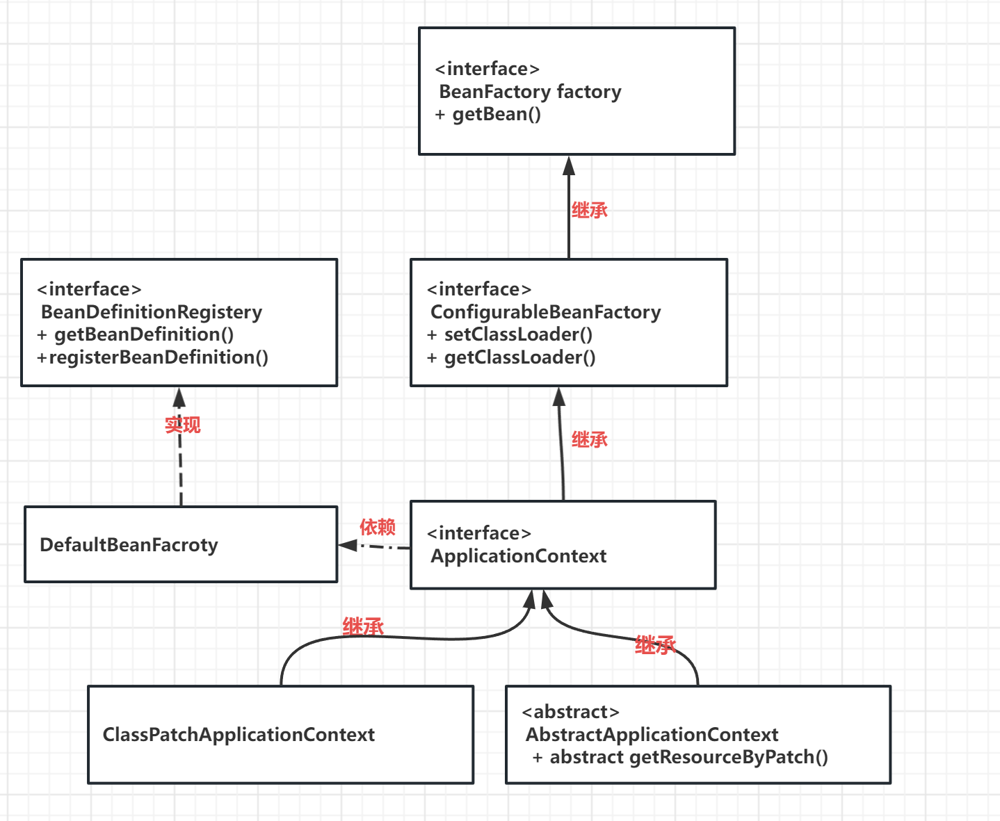
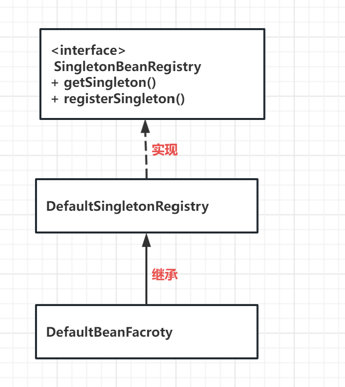
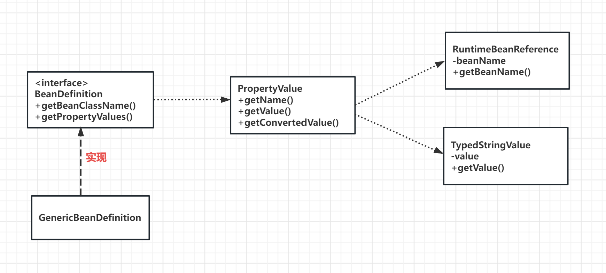

# IoC 

# TDD 的方法 
```text
学习Spring 的设计思想，核心的抽象 
```


# 代码重构--将异常处理 


# 单一职责原则  
SRP :对一个类而言就有一个职责   
DefaultBeanFactory 目前有 2个职责  一个时 解析 xml  一个是通过反射创建对象 

这个设计的缺点是什么？
BeanFactory 是提供给我们的用户来使用的client ,那么我们暴露一个 registerBeanDefinition 的方法 ，具备修改内部结构的能力的 肯定不好。
 - BeanDefinition 是内部的一个概念 ，拥有BeanDefinition的目的是通过反射创建bean的实例 
 - 我们只让客户看到一个最小集 

 - 接口最小化 这个类知道的越少越好 
 - xmlBeanDefinitionReader 它只知道我可以获取BeanDefinition 还可以注册 BeanDefinition 但是它并不知道getBean 的含义是什么 

# 提取 ApplicationContext 接口


# 提取 Resource 接口

# 使用模板方法 抽取 Resource  接口的实现  
 - 定义一个算法的骨架 

# classloader 

# Scope 
 Spring 默认的实现就是 singleton 
 - 单例 
# SingletonBeanRegistry 接口提供实现 singleton的能力 


# 11. 设置属性 

 - TDD思路 
 - 1. 针对接口写 "high level "的测试用例 暂时不用pass ,可以保持 fail 状态 
    -例如ApplicationContextTestV2
 - 2. 针对一些子任务写测试用例 、
   -BeanDefinitionTestV2
   -BeanDefinitionValueResolverTest 
 - 3. 把子任务生成的代码，类组合起来。让 high level 的测试用例pass 